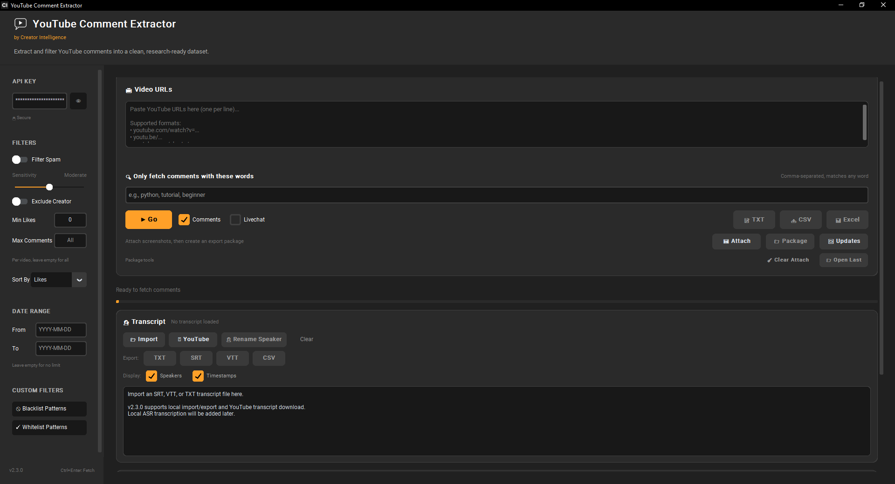

# Modified YouTube Comment Extractor



A modified Windows-friendly version of the YouTube Comment Extractor desktop app.

This version adds extra extraction and export features, including:

- Comments / Livechat selection
- Deep reply fetching
- Support for fetching replies under parent comments
- Faster comment-page delay
- TXT export for Notepad-friendly reading
- CSV and Excel exports
- Spam filtering options
- Date, likes, creator, and keyword filters

This project is a modified version of the original open-source project:

Original project: https://github.com/vijaykumarpeta/yt-comments-extractor

Please see the `LICENSE` file for licensing information.

---

## Download for Windows Users

The easiest way to use this modified version is to download the ready-made Windows ZIP from the **Releases** page.

### Windows EXE Download

1. Go to the [Releases page](https://github.com/TigerXLight/modified-yt-comments-extractor/releases).
2. Download:

```text
YouTube-Comment-Extractor-Windows.zip
```

3. Extract the ZIP file.
4. Open the extracted folder.
5. Double-click:

```text
YouTube Comment Extractor.exe
```

6. Enter your own YouTube Data API key.

Useful links for getting an API key:

- Guide: [How to Get a YouTube API Key](https://docs.themeum.com/tutor-lms/tutorials/get-youtube-api-key/)
- Google Cloud Console: [https://console.cloud.google.com/](https://console.cloud.google.com/)

Notes:

- You may need to activate two-factor authentication / 2FA on your Google account.
- If Google shows a message like **“You have 11 projects remaining in your quota”**, that is normal. It means you still have free project slots left.
- If Google asks what type of data you are accessing, choose **Public data** when your purpose is extracting public YouTube comments from public videos.
- Keep your API key private. Do not upload it to GitHub, Discord, forums, screenshots, public files, or AI chats.

7. Paste one or more YouTube video URLs.
8. Choose whether to extract:
   - Comments
   - Livechat
   - Both
9. Click **Go**.
10. Export results as TXT, CSV, or Excel.

No Python installation is needed when using the Windows ZIP release.

---

## Getting Your YouTube Data API Key

This app requires a YouTube Data API key.

Basic steps:

1. Go to the Google Cloud Console:

```text
https://console.cloud.google.com/
```

2. Create a new project, or select an existing project.

3. In the Google Cloud Console, search for:

```text
YouTube Data API v3
```

4. Click **Enable**.

5. Go to:

```text
APIs & Services → Credentials
```

6. Click:

```text
Create Credentials → API Key
```

7. Copy your API key.

8. Paste it into the app’s API key box.

If Google asks what kind of data you are accessing, choose **Public data** if your goal is extracting public comments from public YouTube videos.

Keep your API key private. Treat it like a password.

---

## Optional: Secure API Key Storage

For secure credential storage, install `keyring`.

With `keyring`, your API key can be stored securely in your operating system’s credential manager.

Without `keyring`, your API key may be stored in a local `settings.json` file.

For best security when running from source code, install `keyring` before running the app:

```bash
pip install keyring
```

The source-code install instructions below include `keyring`.

If you use the Windows EXE release, keyring support may already be bundled if it was included during the build.

When the app shows **Secure** under the API key box, that usually means secure keyring storage is being used.

---

## Run from Source Code

Use this method if you want to run or modify the Python source code.

Important: run these commands in **Command Prompt / CMD**, not inside the Python interpreter.

If you see this prompt:

```text
>>>
```

you are inside Python. Type this first:

```python
exit()
```

Then open CMD normally.

---

## Easy Way to Open CMD in the Correct Folder

If you already have the project folder open in File Explorer:

1. Click the address bar at the top of File Explorer.
2. Type:

```cmd
cmd
```

3. Press Enter.

CMD will open directly inside that folder.

This avoids needing to manually type a long `cd` path.

---

## Recommended Windows Source Install

This downloads the project to your Desktop instead of a random system folder.

Open **Command Prompt** and run these commands one at a time:

```cmd
cd /d "%USERPROFILE%\Desktop"
git clone https://github.com/TigerXLight/modified-yt-comments-extractor.git
cd modified-yt-comments-extractor
python -m venv venv
venv\Scripts\activate
python -m pip install --upgrade pip
pip install keyring
pip install -r requirements.txt
python main.py
```

After this command:

```cmd
venv\Scripts\activate
```

you should see this at the start of your CMD line:

```text
(venv)
```

That means the virtual environment is active.

---

## Mac / Linux Source Install

```bash
cd ~/Desktop
git clone https://github.com/TigerXLight/modified-yt-comments-extractor.git
cd modified-yt-comments-extractor
python3 -m venv venv
source venv/bin/activate
python -m pip install --upgrade pip
pip install keyring
pip install -r requirements.txt
python main.py
```

---

## Walk Through / Guide

1. Launch the app.
2. Enter your YouTube Data API key in the sidebar.
3. Paste one or more YouTube video URLs.
4. Choose extraction mode:
   - **Comments** for normal video comments and replies
   - **Livechat** for live chat replay where available
   - Both if you want both types
5. Configure filters:
   - Filter Spam
   - Sensitivity
   - Minimum likes
   - Sort by likes / newest / oldest
   - Exclude creator comments
   - Date range
   - Keyword filtering
6. Click **Go**.
7. Export results as:
   - TXT
   - CSV
   - Excel

---

## Rawest Extraction Settings

For the most raw extraction possible, use these settings:

```text
Filter Spam: Off
Sort By: Date (Newest)
Max Comments: All / empty
Comments: On
Livechat: Off unless you specifically need livechat
```

When **Filter Spam** is off, the app does not separate comments into the spam output using the spam filter.

This also means the **Sensitivity** setting is effectively disabled, because Sensitivity only matters when spam filtering is turned on.

---

## What Sensitivity Means

The **Sensitivity** slider controls how strict the spam filter is.

It does not control how many comments YouTube sends through the API. It controls how the app classifies comments after they are downloaded.

General meaning:

- **Light**: weaker spam filtering; more comments stay in the main comments file.
- **Moderate**: balanced filtering.
- **Strict / Aggressive**: stronger spam filtering; more suspicious comments may be moved to spam.

For reviewing everything manually, turn **Filter Spam** off.

---

## Supported YouTube URL Formats

The app supports common YouTube URL formats such as:

```text
https://www.youtube.com/watch?v=VIDEO_ID
https://youtu.be/VIDEO_ID
https://www.youtube.com/shorts/VIDEO_ID
https://www.youtube.com/embed/VIDEO_ID
```

You can paste multiple URLs, one per line.

---

## Export Formats

### TXT

Best for reading in Notepad or any plain text editor.

The TXT export is useful when you want to read comments and replies in a simple layout rather than a spreadsheet.

Example TXT layout:

```text
[1] Parent Comment
Author: @ExampleUser
Date: 2026-07-02T00:35:12Z
Likes: 14
Reported replies: 2

Text:
  This is the main comment.

    ↳ Reply
    Author: @ReplyUser
    Date: 2026-07-02T00:40:01Z
    Likes: 3

    Text:
      This is a reply to the main comment.
```

### CSV

Best for opening in spreadsheet programs like Excel, LibreOffice Calc, or Google Sheets.

CSV files may look messy in Notepad because they are designed for spreadsheets.

### Excel

Exports the results into an `.xlsx` workbook.

---

## Replies Under Comments

This modified version is designed to fetch replies under parent comments, including comments with more than 100 replies.

For example, if a parent comment has 150+ replies, the extractor should keep requesting additional reply pages until the available replies are collected.

Important note: YouTube may still hide or withhold some comments/replies from the API if they are deleted, held for review, private, moderated, spam-filtered, or otherwise unavailable.

---

## Sorting

The app includes sorting options:

- Likes
- Date (Newest)
- Date (Oldest)

For the best chance of seeing recent comments, choose:

```text
Date (Newest)
```

---

## Editing the Program Yourself

This project is made of normal Python files, so you can edit it with Notepad, Notepad++, VS Code, or another text editor.

Main files:

```text
main.py        - the desktop app / GUI
extractor.py   - the YouTube extraction logic
spam_filter.py - spam detection logic
core/          - settings, constants, validators, helpers
```

Basic editing steps:

1. Make a backup copy of the file you want to edit.
2. Right-click the file.
3. Choose **Open with → Notepad** or another editor.
4. Make your change.
5. Save the file.
6. Run:

```cmd
python main.py
```

If you get an error, copy the full error text and ask an AI assistant for help.

Useful AI links:

- ChatGPT: [https://chatgpt.com/](https://chatgpt.com/)
- Gemini: [https://gemini.google.com/](https://gemini.google.com/)

Do not paste your API key into ChatGPT, Gemini, Discord, forums, GitHub issues, or screenshots.

When asking for coding help, you can say something like:

```text
I am editing a Python CustomTkinter YouTube comment extractor.
Here is the error I got.
Please tell me exactly what line to replace and what to paste.
```

---

## If You Move the Folder

### If you are using the Windows EXE ZIP

Keep these together:

```text
YouTube Comment Extractor.exe
_internal/
```

Do not move the `.exe` out by itself. It may need files inside `_internal`.

You can move the whole extracted folder anywhere, for example:

```text
Desktop
Documents
D:\Tools
T:\References\to go\Media\tools
```

Then double-click the `.exe` from inside that folder.

---

### If you are running from source code

If you move the source-code folder, your old virtual environment may break because Python virtual environments remember their original folder path.

If that happens, rebuild the virtual environment.

Open CMD inside the moved folder and run:

```cmd
deactivate
rmdir /s /q venv
python -m venv venv
venv\Scripts\activate
python -m pip install --upgrade pip
pip install keyring
pip install -r requirements.txt
python main.py
```

If your folder path has spaces, use quotes:

```cmd
cd /d "T:\References\to go\Media\tools\modified-yt-comments-extractor"
```

Change `T:` to the drive letter where your folder is actually located.

Examples:

```cmd
cd /d "C:\Users\YourName\Desktop\modified-yt-comments-extractor"
cd /d "D:\Tools\modified-yt-comments-extractor"
cd /d "E:\YouTube Tools\modified-yt-comments-extractor"
```

Another easy method:

1. Type this in CMD, including the space after `/d`:

```cmd
cd /d 
```

2. Drag the project folder from File Explorer into CMD.
3. Windows will paste the full folder path for you.
4. Press Enter.

If you are launching an `.exe` from CMD and the path has spaces, use quotes:

```cmd
".\dist\YouTube Comment Extractor\YouTube Comment Extractor.exe"
```

---

## Creating a Desktop Shortcut

### For the Windows EXE version

1. Right-click `YouTube Comment Extractor.exe`.
2. Click **Show more options**.
3. Click **Send to → Desktop (create shortcut)**.

---

### For the source-code version

You can create a `run_app.bat` file to launch the app more easily.

A `.bat` file can be made with Notepad.

1. Open Notepad.
2. Paste this:

```bat
@echo off
cd /d "%~dp0"

if not exist "venv\Scripts\python.exe" (
    echo Virtual environment not found.
    echo Creating venv...
    python -m venv venv
    call venv\Scripts\activate.bat
    python -m pip install --upgrade pip
    pip install keyring
    pip install -r requirements.txt
) else (
    call venv\Scripts\activate.bat
)

python main.py
pause
```

3. Save the file as:

```text
run_app.bat
```

If Windows saves it as:

```text
run_app.bat.txt
```

then it is still a text file.

To fix that:

1. Open File Explorer.
2. Click **View**.
3. Click **Show**.
4. Turn on **File name extensions**.
5. Rename:

```text
run_app.bat.txt
```

to:

```text
run_app.bat
```

Windows will warn you about changing the file extension. Click **Yes**.

A real `.bat` file should say **Windows Batch File** and should no longer have the normal Notepad text-file icon.

Then double-click `run_app.bat` to launch the app.

---

## Sharing Your Modified Version Safely

The easiest way to share this project without accidentally uploading private files is:

1. Keep your original working folder private.
2. Create a separate copied folder for GitHub.
3. Do edits in the copied folder, not the original folder.
4. In the copied folder, remove or ignore:
   - `venv/`
   - `settings.json`
   - `.env`
   - `dist/`
   - `build/`
   - `__pycache__/`
   - exported comment files
   - personal API keys
5. Upload only the clean copied folder to GitHub.

The recommended GitHub setup is:

```text
GitHub repository = source code
GitHub Releases = Windows ZIP / EXE download
```

Do not commit the `dist/` folder directly into the source-code repository.

Instead:

1. Build the Windows app with PyInstaller.
2. Zip the folder:

```text
dist/YouTube Comment Extractor/
```

3. Upload the ZIP to the GitHub **Releases** page.

This lets normal users download the app without needing Python, while keeping the source-code repository clean.

---

## Security Notes Before Sharing or Uploading

If you installed `keyring` and the app shows **Secure** under the API key box, your API key is normally stored in your operating system’s credential manager rather than inside `settings.json`.

If `settings.json` does not contain your API key, and your key is not hardcoded into any `.py` file, you usually do not need to worry about the key being uploaded.

However, before uploading or sharing a copy of the project, it is still best to work from a copied clean folder.

Do not edit or upload your original working folder directly. Make a copied folder first, then remove or ignore files that should not be uploaded.

Do not include:

```text
venv/
settings.json
.env
dist/
build/
__pycache__/
exported CSV, TXT, or Excel files
your personal API key
```

The `.gitignore` file helps prevent these files from being uploaded by Git.

Some test files may contain fake/dummy API-key-looking text, such as strings beginning with `AIza`.

These are not real keys, but GitHub or security scanners may still flag them. To avoid confusion, this modified upload ignores or removes the `tests/` folder from the public copied folder.

---

## Checking for Accidental Google API Keys

Google API keys often begin with:

```text
AIza
```

To search your project folder for possible Google API keys, open CMD inside the folder and run:

```cmd
findstr /s /i "AIza" *
```

You do not replace `AIza` with your real key. The command searches all files for text that looks like the start of a Google API key.

What the command means:

```text
findstr = Windows search command
/s      = search inside subfolders
/i      = ignore uppercase/lowercase
"AIza"  = text to search for
*       = search all files
```

If the command returns nothing, that is good.

If it finds something inside `venv`, `dist`, or a package file, it may be a false positive.

If it finds something in your own files that looks like your real API key, do not upload the folder until you remove it.

If it finds a fake test key in `tests/`, you can remove the `tests/` folder from your copied public folder.

---

## Windows Release Notes

The Windows release ZIP contains a bundled version of the app created with PyInstaller.

The ZIP normally contains:

```text
YouTube Comment Extractor.exe
_internal/
```

Keep the `.exe` and `_internal` folder together. Do not move the `.exe` out by itself.

Some antivirus or Windows SmartScreen warnings can appear for unsigned homemade executables. This can happen with small open-source PyInstaller apps even when the app is safe.

---

## Main Modifications in This Version

Compared with the original project, this modified version includes:

- Added **Go** button with **Comments** and **Livechat** checkboxes
- Added support for choosing comments, livechat, or both
- Added deeper reply fetching
- Added TXT export for Notepad-friendly reading
- Reduced delay between comment pages
- Improved handling for replies and exports
- Added Windows-friendly launch workflow

---

## Development

To run from source:

```bash
python main.py
```

To build a Windows folder-based executable with PyInstaller:

```bash
pyinstaller --noconfirm --clean --windowed --name "YouTube Comment Extractor" --collect-all customtkinter --add-data "assets;assets" main.py
```

The built app will appear in:

```text
dist/YouTube Comment Extractor/
```

To zip the Windows build from CMD:

```cmd
powershell -NoProfile -Command "Compress-Archive -LiteralPath '.\dist\YouTube Comment Extractor' -DestinationPath '.\YouTube-Comment-Extractor-Windows.zip' -Force"
```

---

## Disclaimer

This tool uses the YouTube Data API. Results depend on what YouTube makes available through the API.

Some comments shown on the YouTube website may not be available through the API because of moderation, deletion, privacy, spam filtering, or other YouTube-side limitations.

This project is not affiliated with YouTube or Google.

---

## Credits

Original project by Vijay Kumar Peta:

https://github.com/vijaykumarpeta/yt-comments-extractor

Modified version maintained by TigerXLight.